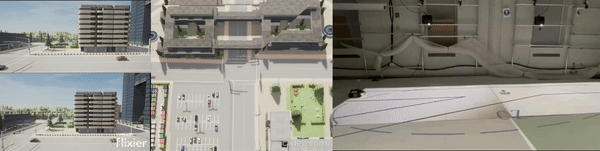

  

    
  

  

    <h1> Ehsan Sabouni </h1>
    
    <h3> Ph.D candidate of <a href="https://www.bu.edu/eng/departments/se/" target="_blank">Systems Engineering</a>, <a href="https://www.bu.edu" target="_blank">Boston University</a> </h3>
    
    
 <strong>Advisor:</strong> <a href="https://christosgcassandras.org/" target="_blank"> Prof. Christos Cassandras </a> 

    
    
 <strong>Research Interests:
       

       &nbsp; Safety-critical systems
         &nbsp; Autonomous driving
         &nbsp; Multi-agent systems
         &nbsp; Reinforcement learning
       
</strong>
     

      
<h3> <strong>Selected Projects:</strong> </h3>

  

* **Optimal control of connected automated vehicles with event-triggered control barrier functions: a test bed for safe optimal merging** [<a href="https://ieeexplore.ieee.org/abstract/document/10253379" target="_blank">PDF</a>]
    E Sabouni, HMS Ahmad, W Xiao, CG Cassandras, W Li
    Outstanding student paper at 2023 IEEE Conference on Control Technology and Applications (CCTA), 321-326.
  
* **Optimal Control of Connected Automated Vehicles with Event/Self-Triggered Control Barrier Functions** [<a href="https://arxiv.org/abs/2209.13053" target="_blank">PDF</a>]
    E Sabouni, CG Cassandras, W Xiao, N Meskin
      about to appear on Automatica 2024

* **Secure Control of Connected and Automated Vehicles Using Trust-Aware Robust Event-Triggered Control Barrier Functions** [<a href="https://arxiv.org/pdf/2401.02306.pdf" target="_blank">PDF</a>][<a href="https://github.com/SabbirAhmad26/Trust_based_CBF.git" target=" blank" code </a>]
    HM Ahmad, E Sabouni, A Dickson, W Xiao, CG Cassandras, W Li
